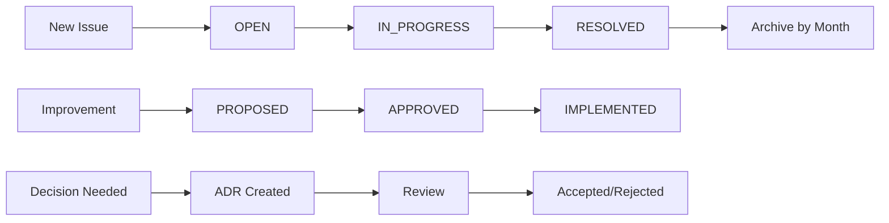

# Overview {#overview}

This CHANGELOG system provides structured tracking for:
- **Issues**: Bugs and problems that need fixing
- **Improvements**: Enhancement proposals and feature requests
- **Decisions**: Architecture Decision Records (ADRs) documenting key design choices
- **Releases**: Version history and release notes

## Current Status {#status}

### 🔴 Open Issues (5)

| Issue | Title | Severity | Component |
|-------|-------|----------|-----------|
| [ISSUE_001](issues/OPEN/ISSUE_001_d01_dataframe_naming.md) | D01_01.R DataFrame Naming Conventions | Medium | D01_derivations |
| [ISSUE_002](issues/OPEN/ISSUE_002_d01_na_validation.md) | D01_01.R Incorrect NA Validation Fields | High | D01_derivations |
| [ISSUE_003](issues/OPEN/ISSUE_003_dataframe_overwrite.md) | Cleansed DataFrame Should Always Be Overwritten | Medium | data_processing |
| [ISSUE_004](issues/OPEN/ISSUE_004_column_naming_pattern.md) | Column Naming Convention for Operations | Low | naming_conventions |
| [ISSUE_005](issues/OPEN/ISSUE_005_date_aggregation_functions.md) | Incorrect Date Aggregation Functions | High | data_processing |

### 🟡 In Progress Issues (0)

*No issues currently in progress*

### 🟢 Recently Resolved (0)

*No recently resolved issues*

## How to Use This System {#usage}

### Creating a New Issue

1. Identify the problem and its severity
2. Create a new file in `issues/OPEN/` with pattern `ISSUE_XXX_description.md`
3. Use the issue template below
4. Update this index with the new issue

### Issue Template

```markdown
---
issue: "ISSUE_XXX"
title: "Brief description"
severity: "low|medium|high|critical"
component: "affected component"
created: "YYYY-MM-DD"
status: "open|in_progress|resolved"
---

## Problem
[Description of the issue]

## Expected Behavior
[What should happen]

## Actual Behavior
[What actually happens]

## Proposed Resolution
[Suggested fix]

## Resolution
[How it was fixed - filled when resolved]
```

### Creating an Architecture Decision Record (ADR)

1. Document the context requiring a decision
2. Create a new file in `decisions/` with pattern `YYYY-MM-DD_decision_name.md`
3. Use the ADR template below
4. Link related principles or rules

### ADR Template

```markdown
---
id: "ADR-XXX"
title: "Decision title"
date: "YYYY-MM-DD"
status: "proposed|accepted|deprecated"
related_to:
  - "MP/P/R numbers"
---

## Context
[Why this decision was needed]

## Decision
[What was decided]

## Consequences
[Impact of this decision]

## Alternatives Considered
[Other options that were evaluated]
```

## Directory Structure {#structure}

```
CHANGELOG/
├── index.qmd                  # This file
├── issues/                    # Bug tracking
│   ├── OPEN/                  # Active issues
│   ├── IN_PROGRESS/           # Being worked on
│   └── RESOLVED/              # Completed (by month)
├── improvements/              # Enhancement tracking
│   ├── PROPOSED/              # New ideas
│   ├── APPROVED/              # Approved for work
│   └── IMPLEMENTED/           # Completed
├── decisions/                 # Architecture decisions
└── releases/                  # Version history
```

## Recent Decisions {#decisions}

### 2025-06 Decisions
- [Database Status Display](decisions/2025-06-28_database_status_display.md)

### 2025-04 Decisions
- [Functor Module Correspondence](decisions/2025-04-07_functor_module_correspondence_principle.md)
- [Universal Data Access Pattern](decisions/2025-04-10_universal_data_access_pattern.md)
- [Universal DBI Approach](decisions/2025-04-10_universal_dbi_approach.md)
- [Template Organization Principle](decisions/2025-04-10_template_organization_principle.md)
- [NSQL Language Implementation](decisions/2025_04_04_nsql_language_implementation.md)

## Issue Severity Levels {#severity}

| Level | Description | Response Time |
|-------|-------------|---------------|
| **Critical** | System breaking, data loss risk | Immediate |
| **High** | Major functionality broken | Within 24 hours |
| **Medium** | Functionality impaired | Within week |
| **Low** | Minor issues, improvements | As time permits |

## Workflow {#workflow}



## Contributing {#contributing}

### For Issues
1. Check if issue already exists
2. Create issue file with next available number
3. Set appropriate severity
4. Provide clear reproduction steps
5. Update this index

### For Improvements
1. Document the enhancement clearly
2. Explain benefits and impact
3. Consider implementation effort
4. Link to related principles

### For Decisions
1. Provide full context
2. List alternatives considered
3. Document trade-offs
4. Link to affected components

## Statistics {#stats}

- **Total Open Issues**: 5 (2 High, 2 Medium, 1 Low)
- **Total ADRs**: 40+
- **Active Improvements**: 0
- **Last Updated**: 2025-08-23

---

*This CHANGELOG system helps maintain code quality and tracks the evolution of the MAMBA/WISER architecture.*