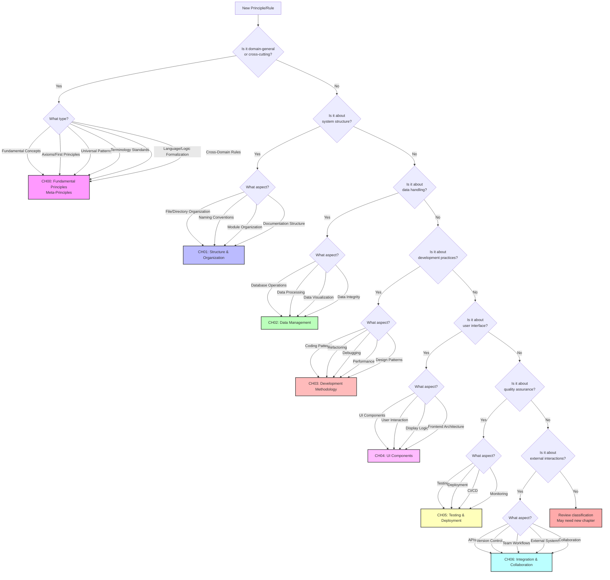

# Principle Classification Decision Tree

This decision tree helps determine which chapter (law) a new principle or rule should belong to.

## Visual Decision Tree

## Text-Based Decision Process

### Step 1: Domain-General Check
**Question**: Is this domain-general or cross-cutting across the entire system?
- Fundamental concepts → CH00
- Axioms and first principles → CH00
- Universal patterns → CH00
- Terminology and language standards → CH00
- Logic formalization → CH00
- Cross-domain rules → CH00
- **No match** → Continue to Step 2

### Step 2: Structure Check
**Question**: Is this about how the system is organized or structured?
- File/folder organization → CH01
- Naming conventions → CH01
- Module/component structure → CH01
- Documentation organization → CH01
- **No match** → Continue to Step 3

### Step 3: Data Check
**Question**: Is this about data handling, storage, or processing?
- Database operations → CH02
- Data transformation → CH02
- Data validation → CH02
- Data visualization → CH02
- **No match** → Continue to Step 4

### Step 4: Development Check
**Question**: Is this about development practices or methodologies?
- Coding patterns → CH03
- Refactoring strategies → CH03
- Debugging approaches → CH03
- Performance optimization → CH03
- Design patterns → CH03
- **No match** → Continue to Step 5

### Step 5: UI Check
**Question**: Is this about user interface or user experience?
- UI components → CH04
- User interactions → CH04
- Display logic → CH04
- Frontend patterns → CH04
- **No match** → Continue to Step 6

### Step 6: Quality Check
**Question**: Is this about ensuring quality or deployment?
- Testing strategies → CH05
- Deployment processes → CH05
- CI/CD pipelines → CH05
- Monitoring → CH05
- **No match** → Continue to Step 7

### Step 7: Integration Check
**Question**: Is this about external interactions or team collaboration?
- API design → CH06
- Version control → CH06
- Team workflows → CH06
- External integrations → CH06
- Code reviews → CH06
- **No match** → Review and consider new chapter

## Edge Cases and Multiple Categories

When a principle could belong to multiple categories:

1. **Primary Function Rule**: Choose based on the primary purpose
2. **Impact Scope Rule**: Choose based on where it has the most impact
3. **Dependency Rule**: Place it with its strongest dependencies

### Common Edge Cases

| Principle Type | Could Be | Decision | Rationale |
|---------------|----------|----------|-----------|
| API Documentation | CH01 or CH06 | CH06 | Primary purpose is integration |
| Test Data Management | CH02 or CH05 | CH05 | Primary purpose is testing |
| UI Data Binding | CH02 or CH04 | CH04 | Primary impact on UI |
| Module Testing | CH03 or CH05 | CH05 | Primary purpose is quality assurance |
| Database Schema | CH01 or CH02 | CH02 | Primary purpose is data management |
| Git Workflow | CH03 or CH06 | CH06 | Primary purpose is collaboration |
| Error Handling | CH03 or CH04 | CH03 | Applies across all development |
| Configuration Management | CH01 or CH06 | CH01 | Structural organization concern |
| Logic Formalization | CH00 or CH01 | CH00 | Domain-general language standard |
| Archiving Standards | CH00 or CH01 | CH01 | Specific to file organization |
| Recursive Sourcing | CH00 or CH03 | CH03 | Specific development technique |

## Cross-References

When a principle spans multiple chapters:
1. Place it in the most appropriate chapter
2. Add cross-references in the `related_to` field
3. Consider creating complementary rules in other chapters

## Review Triggers

Consider creating a new chapter when:
1. More than 10 principles don't fit existing categories
2. A clear new domain emerges (e.g., Security, Performance, Accessibility)
3. Existing chapters become too large (>50 principles/rules)

---

*Last Updated: 2025-08-17*  
*Use this decision tree when classifying new principles and rules*