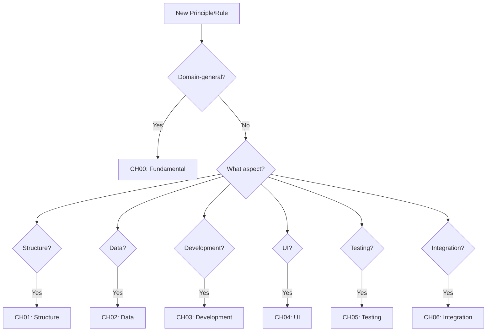

# CLAUDE.md - Comprehensive AI Assistant Guidelines

This document provides guidelines for working with **ANY company project** using the global_scripts principles system.

**Company-Agnostic**: These guidelines apply to ALL companies (VitalSigns, BrandEdge, MAMBA, WISER, kitchenMAMA, etc.) across ALL tiers (l1_basic, l2_pro, l3_premium, l4_enterprise).

## 🔴 CRITICAL: Agent Usage Requirements

### ⚠️ ALL principle modifications MUST use the `principle-revisor` agent

```bash
# For ANY principle-related changes, use:
Task tool with subagent_type: "principle-revisor"
```

**This requirement applies to:**
- Creating new MPs, Ps, or Rs
- Modifying existing principles
- **Renumbering principles** (MP, P, R)
- Moving principles between chapters
- Reorganizing principle structure
- Creating principle documentation
- Moving files to CHANGELOG
- Resolving principle conflicts
- Updating principle references

**NEVER directly edit principle files without principle-revisor**

### ⚠️ ALL code writing MUST use the `principle-coder` agent

```bash
# For ANY code development that follows MAMBA/WISER principles, use:
Task tool with subagent_type: "principle-coder"
```

**This requirement applies to:**
- Writing new R/Python functions or modules
- Refactoring existing code
- Implementing database operations
- Creating Shiny components
- Writing test scripts
- Developing utility functions
- **Writing code that implements principles**

**The principle-coder agent ensures:**
- Adherence to all documented principles
- Proper naming conventions (fn_, sc_, etc.)
- Correct architectural patterns
- Functional programming paradigms
- Vectorization requirements
- Module organization standards
- Company-agnostic code that works across all projects

### 📝 Clear Distinction:

| Task Type | Required Agent | Examples |
|-----------|---------------|----------|
| **Principle Management** | `principle-revisor` | • Renumbering principles<br>• Editing principle content<br>• Moving principles between chapters<br>• Creating new MPs/Ps/Rs |
| **Code Development** | `principle-coder` | • Writing functions (fn_*.R)<br>• Creating modules<br>• Implementing features<br>• Writing scripts that follow principles |

## 🚨 Critical Setup Requirements

### Working Directory Configuration

**CRITICAL**: All R scripts must be run from the **company project root directory**.

```bash
# Pattern: Navigate to company project root
cd /Users/che/.../ai_martech/{tier}/{companyname}/

# Examples:
cd /Users/che/.../ai_martech/l4_enterprise/MAMBA/
cd /Users/che/.../ai_martech/l1_basic/VitalSigns/
cd /Users/che/.../ai_martech/l4_enterprise/kitchenMAMA/

# Then run scripts with full paths
Rscript scripts/update_scripts/script_name.R
```

**Why this matters**: The `autoinit()` function and database connections only work from project root.
This applies to **ALL companies**, not just MAMBA.

## 📁 Directory Structure

### Company Project Structure (Generic Pattern)
```
{tier}/{companyname}/
├── scripts/
│   ├── global_scripts/      # Git subrepo (shared across all companies)
│   │   ├── 00_principles/   # This principles system
│   │   ├── 01_db/          # Database connections
│   │   ├── 02_db_utils/    # Database utilities (tbl2)
│   │   ├── 04_utils/       # General utilities
│   │   ├── 08_ai/          # AI integration
│   │   ├── 10_rshinyapp_components/  # Shiny components
│   │   ├── 16_NSQL_Language/    # NSQL framework
│   │   ├── 22_initializations/  # Initialization scripts
│   │   └── 25_scripts/     # Executable scripts
│   └── update_scripts/     # Company-specific scripts
├── data/                   # Company-specific data
├── app_config.yaml        # Application configuration
└── app.R                  # Main application file
```

### Principles Organization
```
00_principles/
├── natural/
│   ├── en/               # English version
│   │   ├── part1_principles/  # 257+ principles by chapter
│   │   ├── part2_implementations/  # Implementation guides
│   │   └── part3_domain_knowledge/  # Domain knowledge
│   └── zh/               # Chinese version (same structure)
├── CLAUDE/               # AI guidelines (this directory)
├── CHANGELOG/            # Change tracking
└── REFERENCES/           # Bibliography
```

## 📝 File Naming Conventions

### Principles and Rules
- **Meta-Principles**: `MP{NUMBER}_{description}.qmd`
- **Principles**: `{CATEGORY}_P{NUMBER}_{description}.qmd`
- **Rules**: `{CATEGORY}_R{NUMBER}_{description}.qmd`
- **Modules**: `M{NUMBER}_{description}.qmd`
- **Derivations**: `D{NUMBER}_{description}.qmd`
- **Solutions**: `SLN{NUMBER}_{description}.qmd`

### Category Abbreviations
- **SO**: Structure & Organization
- **DM**: Data Management
- **DEV**: Development Methodology
- **UI**: UI Components
- **TD**: Testing & Deployment
- **IC**: Integration & Collaboration
- **TS**: Terminology Standards

### Function and Script Files
- **Functions**: `fn_{function_name}.R`
- **Scripts**: `sc_{script_purpose}.R`
- **Templates**: `template_{type}.R`

## 🎯 Critical Code Patterns

### 1. Function Parameter Specification (MP081)

#### ⚠️ radioButtons Parameter Specification

**ALWAYS use named parameters:**
```r
# CORRECT - Named parameters
radioButtons(
  inputId = "platform",
  label = NULL,
  choices = c("Amazon" = 2, "All Platforms" = 0),
  selected = 2
)

# INCORRECT - Positional parameters (AVOID)
radioButtons("platform", NULL, c("Amazon" = 2, "All Platforms" = 0), 2)
```

### 2. Data Access Pattern (R116)

**Use tbl2() for enhanced data access:**
```r
# CORRECT - Using tbl2
tbl2(con, "database.table")

# Handles attached databases automatically
dbAttachDuckdb(con, path = "other.duckdb", alias = "other_db")
tbl2(con, "other_db.table_name")
```

### 3. Error Handling with NULL/NA (MP035)

**Always check NULL before NA:**
```r
# CORRECT - Complete validation
if (!is.null(x) && !is.na(x) && as.numeric(x) > 0) {
  # Safe to use x
}
```

## 📁 CHANGELOG Management Policy

### All Principle Reviews and Modifications Go to CHANGELOG/

**The following documents should NEVER be in the root directory:**
- `PRINCIPLE_*.md` files (audits, reports, proposals)
- `CHAPTER_*.md` files (reorganization plans)
- `MP_*.md` files (reclassification documents)
- Any constitutional amendments or migration guides

**Correct structure:**
```
CHANGELOG/
├── reviews/              # Principle reviews and audits
│   └── YYYY-MM-DD_topic/ # Date-based organization
├── decisions/            # Architectural decisions (ADRs)
├── improvements/         # Improvement proposals
├── issues/              # Problem reports
└── releases/            # Version releases
```

### When Creating Review Documents

1. **Always use principle-revisor agent**
2. **Place output in appropriate CHANGELOG subdirectory**
3. **Use date-based folders for organization**
4. **Never leave review documents in root**

## 📋 QMD Conversion Guidelines

### QMD File Structure Template
```yaml
---
title: "{TYPE}_{NUMBER}: {Title}"
subtitle: "{Description}"
chapter: "CH{XX}"
category: "principle" | "rule" | "module"
number: "{TYPE}_{NUMBER}"
date-created: "YYYY-MM-DD"
date-modified: "YYYY-MM-DD"
author: "Claude"
type: "principle" | "rule" | "module"
law: "{Law Name}"
article: "Article {N}"
related_to:
  - "Reference 1"
  - "Reference 2"
format:
  html:
    toc: true
    toc-depth: 3
    code-fold: false
    code-tools: true
    number-sections: true
---
```

### Chapter Classification Decision Tree



### Bilingual Version Requirements

⚠️ **Important Update Order**:
1. **Update English version first** in `en/` directory
2. **Then update Chinese version** in `zh/` directory
3. Ensures version consistency
4. Content should correspond but use appropriate language

## ❌ Common Mistakes to Avoid

### Directory Issues
- Creating `zh_TW/` or `zh_CN/` instead of just `zh/`
- Not starting from project root directory
- Wrong path for initialization scripts

### Naming Issues
- Duplicate principle numbers (e.g., two DEV_P005)
- Missing prefixes (fn_, sc_) for functions and scripts
- Inconsistent category abbreviations

### Code Issues
- Using positional parameters instead of named ones
- Not checking NULL before NA
- Using `tbl()` instead of `tbl2()` for database access
- Missing error handling with tryCatch

### Documentation Issues
- English content in Chinese versions or vice versa
- Domain-general content in specific chapters
- Forgetting to move processed files to archive
- Not updating index files after adding new content

## 📊 File Processing Workflow

1. **Identify**: Read files from `archive/principles_pending/`
2. **Classify**: Determine appropriate chapter using decision tree
3. **Validate**: Check for duplicate numbers
4. **Create**: Generate QMD files (both languages if needed)
5. **Archive**: Move processed files to `archive/principles_processed/`
6. **Update**: Modify index and tracking files

## 🔧 Key Principles to Remember

1. **MP081**: Explicit Parameter Specification
2. **MP035**: Null Special Treatment
3. **MP068**: Language as Index
4. **R116**: Enhanced Data Access (tbl2)
5. **R021**: One Function One File
6. **R069**: Function File Naming
7. **MP044**: Functor-Module Correspondence
8. **MP047**: Functional Programming

## 📝 Progress Tracking

Maintain these tracking files:
- `CONVERSION_TRACKING.md` - QMD conversion progress
- `CLAUDE_CHANGE_LOG.qmd` - Changes to guidelines
- Index files in each chapter

## 🚀 Quick Reference Checklist

Before starting any task:
- [ ] Changed to project root directory
- [ ] Verified `app_config.yaml` exists
- [ ] Checked `autoinit()` function availability
- [ ] Reviewed relevant principles
- [ ] Understood file naming conventions
- [ ] Know which chapter/directory to use

---

*Last Updated: 2025-08-23*
*This document combines guidelines from both QMD conversion and WISER development contexts*